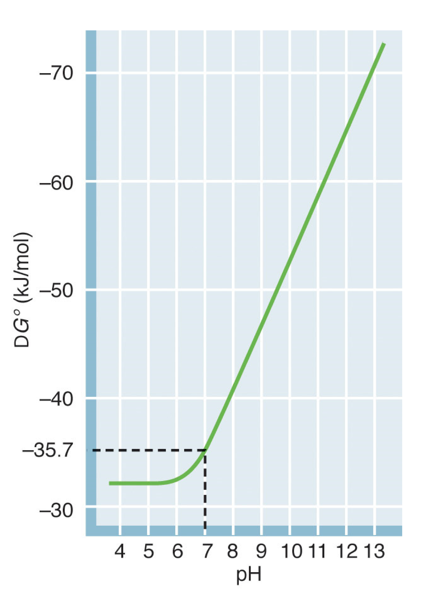
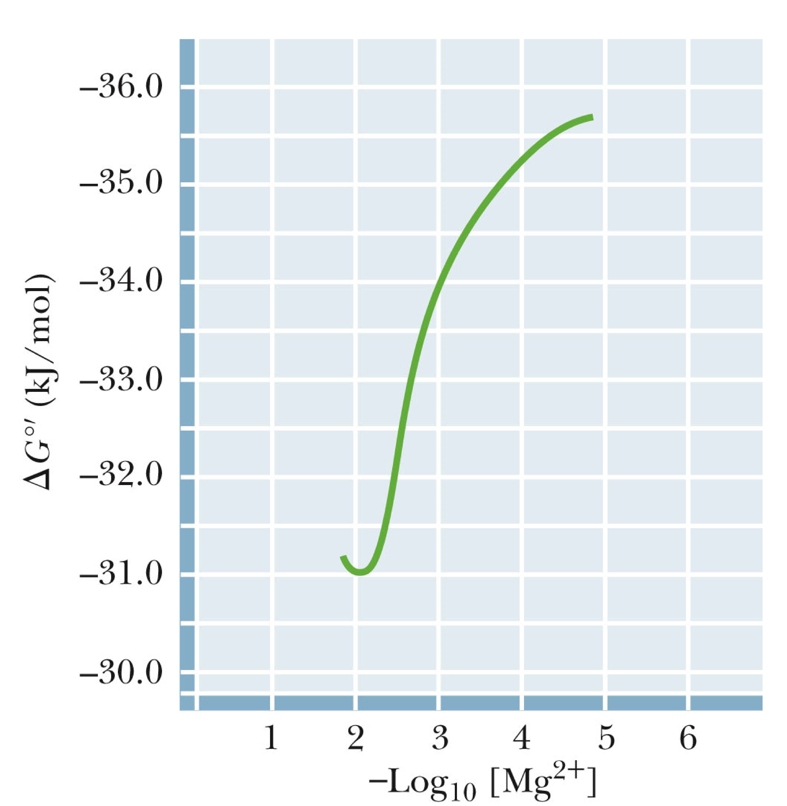
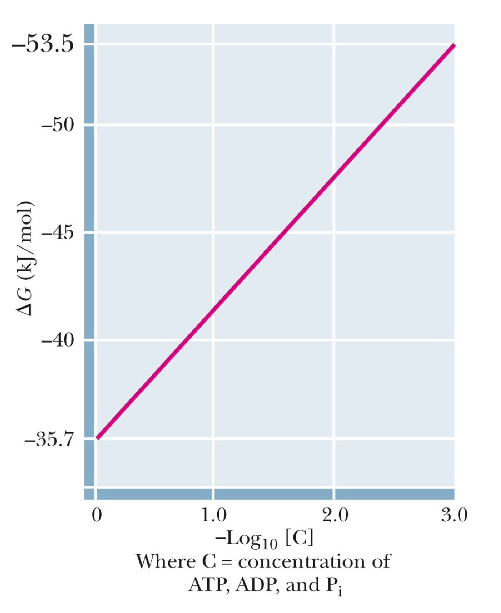

# Imports

import HighEnergyCompound as HighEnergyCompound

# Adenosine Triphosphate

## Structure
ATP consist of three phosphate groups, linked together by P-O bonds and covalently bonded onto a pentose sugar attached to the nitrogenous base Adenosine. 

## Free energy of hydrolysis 
ATP is classified as an high energy compound because of its high free energy of hydrolysis, ($\approx 30.5 kJ\cdot mol^{-1}$), under physiological conditions. 

###__HighEnergyCompound:High Energy Compound__ 

### General explanation 
The energetic favourability of ATP hydrolysis can generally be explained by three causative factors. 

#### Electrostatic repulsion 
The close packing of negative charge within anhydride phosphate chain results in considerable electrostatic repulsion, which places strain of the molecule, particularly on the linking P-O bonds. This repulsion decreases the stability of the molecule (raising its energy). 

#### Resonance stabilisation 
The free phosphate released by hydrolysis is more stable than a phosphate bound to the phosphate chain as it can experience increased resonance stabilisation. Within the phosphate chain the P-O bonds interfere with this resonance. 

#### Entropic considerations
The hydrolysis reaction involves the conversion of two reactants (ATP and water) to three products. (ADP, phosphate and an $H^+$ ion). This increase in the number of molecules (all in the same, aqueous, state) implies an increase in entropy and so the process in entropically favoured. 

### Affecting factors. 
 
#### PH 
The free energy of hydrolysis is dependant on the pH, as protonation of the $O^-$ groups within the anhydride implies reduced electrostatic repulsion. The three $O^-$ groups contained within the chain have very low $pK_a$ values (<3), and so are not so important for biological considerations. The terminal $O^-$ group however has a $pK_a$ value of about 7, which falls within the physiological pH range.

The Free energy of hydrolysis therefore remains relatively stable in the pH range of 4-6, changing to an approximately linear increase in free energy (more negative) as pH increases above 7. 

 > NOTE: There are multiple ionisations of ATP, ADP and phosphate which can all affect the $K_{eq}$ and hence the $\Delta G ^\cric$ of hydrolysis

#### Metal cations. 
Increases in magnesium ion concentration lead to a decrease in the free energy of hydrolysis, due to more shielding of electrostatic repulsion within the anhydride phosphate chain, which reduces strain in the anhydride linkages. Under physiological conditions magnesium concentration is very high, so high that it can be taken as in excess (which leads to the $-30.5kJ\cdot mol^{-1}$ value normally quoted). 

> Question: Does this effect happen equally with other biological cations.  

#### Concentration 
Under physiological conditions the concentrations of ATP, ADP and Phosphate are relatively low, at maximum only about $8 mM$, whereas standard concentration is 1M.
Increasing the cumulative concentration of ATP, ADP and $P_i$, with increasing concentration the free energy of hydrolysis decreases. Free energy of hydrolysis is therefore much higher at physiological concentration than at standard concentration. This trend can be explained by the affect of concentration change on the equilibrium constant, as by the law of mass action the lower the equilibrium constant the more the equilibrium will shift towards the right (favouring product formation). 

NOTE: The decrease in the equilibrium constant results because provided the ATP ADP and $P_i$ concentrations are all within the same general range, then if theses concentrations are all low then $[ADP][P_i]<<[ATP]$.  

### Daily human requirement for ATP. 
The average human requires about $11 700kJ$ of energy per day, at 50\% efficiency this implies $5860kJ ATP$ is required per day, which corresponds to a $65Kg$ of ATP per day, which in turn implies that ATP molecules are recycled about 1300 times a day. If this much ATP had to be bought at market price it would cost about 9m a day. 

### Energy barrier
Because the activation energy of ATP hydrolysis is very large, ATP will not typically undergo hydrolysis with the presence of the appropriate enzymes to lower this energy barrier. 

## Reaction coupling
Coupling a reaction with ATP hydrolysis can have a dramatic effect on the $K_eq$ of the reaction. 

# Appendix 
 
##__HighEnergyCompound__
