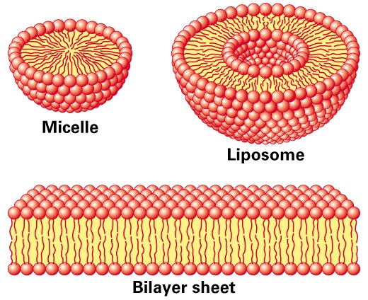

# Imports
# Biological Molecules

### Basic list
* Carbohydrates (2%)
* Lipids (2.5%)
* Proteins (15%)
* Nucleic Acids (RNA 20% E. Coli < 10% mammalian DNA is functional )
* Inorganic ions (3% Salts, 1% small metabolites)
* water (70%)

### Water

#### general properties
covalent bonds.
dipole moment.

##### hydrogen bonds.
many hydrogen bonds are formed which together gain considerable strength.

Hydrogen bonds are typically up to $ angstroms in length, which a strength of 2-10kcal/mol.

NOTE: the advantage of hydrogen bonds is that they do not take too much energy to break down so the body can readily re-purpose/recycle organic compounds.

##### polarity
high polarity means water has a large ability to stabilise other charges

##### 
auto ionisation.
water can auto ionise into hydroxide ions and hydronium ions, the concetrations of which in solution can be measured by pOH and pH respectively.  

##### Solvation of ionic and polar solutes

$\text{Coulomb’s law : } F = k\frac{ q_{1}q_{2}}{ Dr^{2}}$

Where D is a measure of solvent polarity.The higher the polarity, the greater the ability to stabilise charges. water forms solvations shells around each ion.

##### Solvation of apolar groups and molecules (the hydrophobic effect)
free amphipathic molecules will associate in water to form hydrophobic internal environments. molecules (amphipathic molecules contain both polar and a polar groups )

###### Examples

Integral proteins within the cell membrane are amphipathic, and allow for non polar channels through the membrane.

fatty acids form micelles (globules) and bilayers in water.

###### Septicaemia
Certain bacteria, respond to antibiotics by releasing proteins which punch holes in the cell surface membrane creating freely permeable pore through which cell contense can leak out, and killing the cells.

#### water and protein structure
water proteins can be buried in the interior of protein structures where they may furfill vital functions

##### examples
proteases only work if the have a water molecule imbedded within their internal structure, without this one molecule the entire enzyme becomes inactive.

other examples are reverse transcriptase and HIV protease and GST (detoxifying enzyme) which all rely on water molecules to function.

# Appendix

