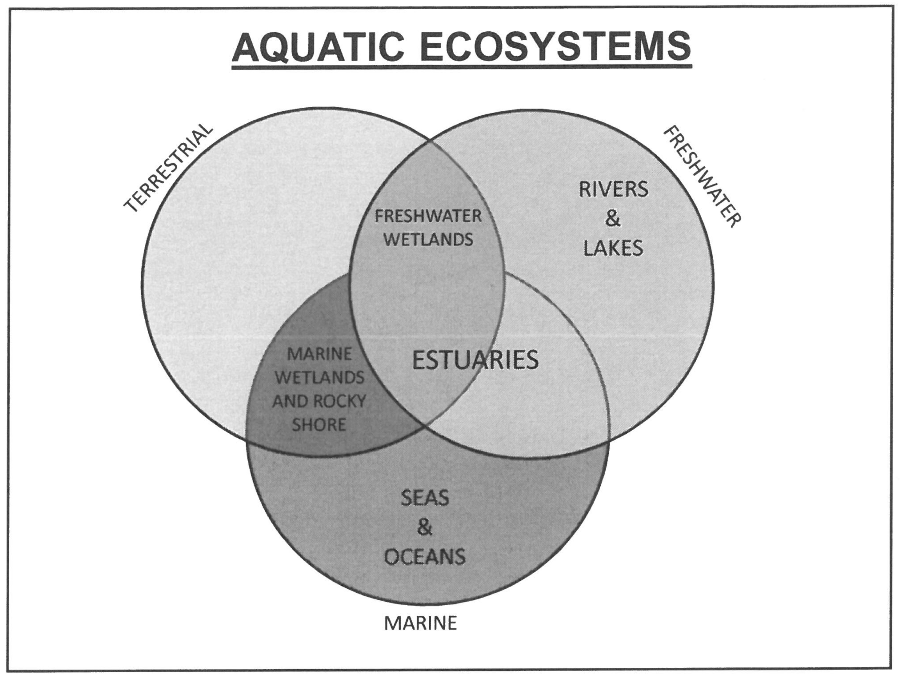

---
title:"Aquatic Ecosystem Taxonomy"
output: html_document

---

# Imports
import RiverTaxonomy as RiverTaxonomy

# Aquatic Ecosystem Taxonomy
The seas and freshwater constitute the two major forms of aquatic ecosystems. Additionally, the ecotone between sea and the terrestrial ecosystem forms marine wetland and rocky shore ecosystems, and the overlap between freshwater systems and the terrestrial ecosystem forms freshwater wetland systems. Finally the overlap of terrestrial, freshwater and marine systems form estuaries. 

> NOTE: Estuaries could also be thought of as the overlap of freshwater wetlands with the sea. 

##__RiverTaxonomy: River Taxonomy__ 

