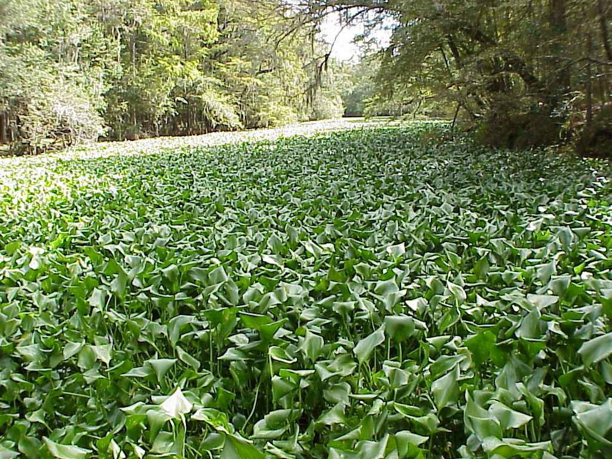

# Imports

import InvaisiveSpeciesLegislation as Legislation

import InvaisiveSpeciesInvaisionPathways as IP

import InvaisiveSpeciesControlMethods as ISCM

import CommercialAquaculture as CA

# Invasive Aquatic Species 
Important invasives include, animal plant and algal species. 

## Economic 
The economic importance of many invasive species sets up a conflict of interest between social/economic and environmental objectives. 

### __CA: Commercial Aquaculture__

### __Legislation: Invasive Aquatic Species Legislation__
 
## Impacts
Invasive species can negatively impact the ecosystem function, recreational value and economic activity of an aquatic system. 

## __IP: Invasive Species Invasion Pathways__

## __ISCM: Invasive Species Control Methods__

## Examples

### Killer shrimp 
The killer shrimp is a vicarious predator which kills other amphipods. I was introduced via Ballast water.

### Zebra and Quagga muscles
_Dreissena spp_

Invaded the great lakes via ballast water and through Biofouling. 

### Water Hyacinth 
_Eichhornia crassipes_

Water hyacinth was originally introduced as a pond decoration. It propagates vegetatively and hence rapidly, particularly in lentic warm water such as in the Hartbeespoort dam where 40\% of the dam surface is covered with hyacinth. The hyacinth obstructs water movement, (and movement of boats,and degrades water quality, as the light blocked prevents photosynthesis within the lake itself,and may lead to nutrient depletion (although not in Hartbeespoort due to all the sewerage) Hyacinth is also problematic because it harbours pathogenic vectors such as mosquito eggs which are far more protected in droplets on hyacinth leaves, then floating free on the water surface where they are exposed to predation by fish. 

The water hyacinth problem on Hartbeespoort dam has been ongoing for approximately 20 years, predominately because Local government does not have sufficient money to properly finish the job.

{width=40%}
