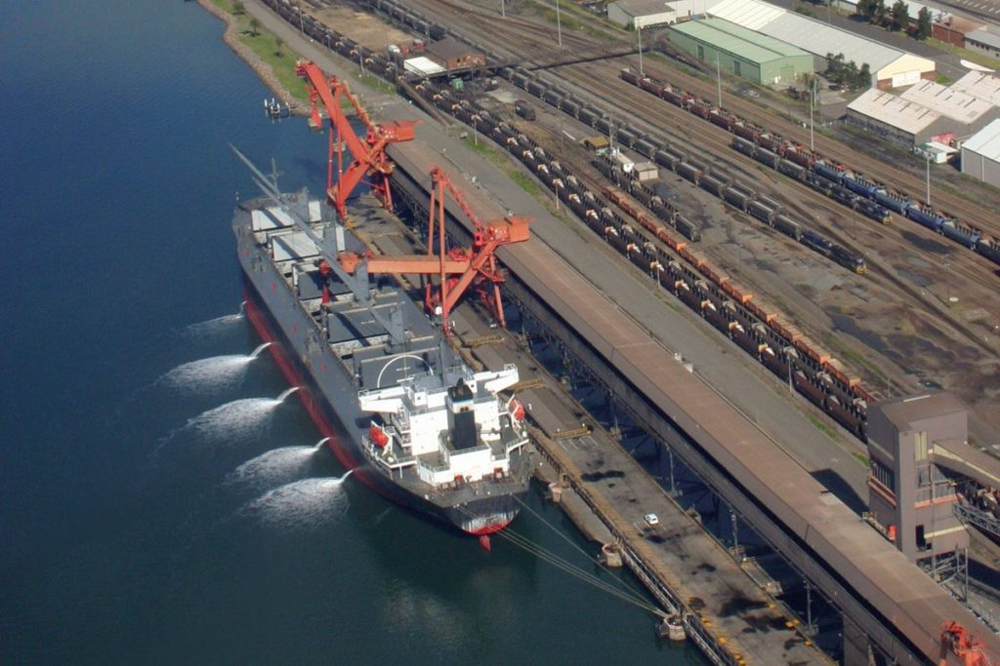

# Imports

import InvaisiveSpeciesLegislation as Legislation

import InvaisiveSpeciesInvaisionPathways as IP

import InvaisiveSpeciesControlMethods as ISCM

import CommercialAquaculture as CA

# Invasive Aquatic Species
Important invasives include, animal plant and algal species. 

## Economic
The economic importance of many invasive species sets up a conflict of interest between social/economic and environmental objectives. 

># Commercial Aquaculture
>In South Africa 943 tons of trout, and 10 tones of Nile tilapia are harvested every year.
>
>


># Invasive Aquatic Species Legislation
>
>## South Africa
>
>### History
>In South Africa For a long period of time there was no legislation governing the management of invasive aquatic species at all. Furthermore for a long period after that there where many local ordinances to ensure the survival of invasive fish species, due to their commercial and recreational importance, for example fishing of such species during breeding their breeding season was prohibited. By the 1980s neither local nor invasive fish had any form of legal protection, and indeed it was not until the 2000s. 
>
>
>### First Legislation Drafted.
>The First legislation drafted was in the form of a species list which it was envisaged the national government would be responsible for compiling and local governance would be responsible for regulating. The compilation process took a long time, mainly because of a lack of research regarding the ecological effect of aquatic invasive available, on which policy decision could be made, so was only prepared by 2013.This draft contained several different categories of species. 
>
>##### Category 1b
>For species in Category 1b most uses are prohibited and control is required. For example species such as Carp and Bass.
>
>#### Category 2
>Species May be utilised by those granted legal permits. For example several antelope species. This category however originally contained no fish species, and as a result the entire draft was decidedly unpopular.
>
>#### Lobbying
>Due to its unpopularity there was much lobbying against the first species list drafted. In particular the Trout SA lobby group, which consisted of Aquaculture companies as well as recreational fishers was very active in lobbying government and influencing the press. The aim of the association was for trout to be de-listed as an invasive species due to the socio-economic importance of the trout industry. As a result of this lobbying the 2103 Draft was never pasted into law,and instead a new list was drafted. 
>
>### First legislation
>After the rejection of the first draft, a new draft was prepared in 2014, which was passed into law. The new draft maintained the same general categories but shifted many fish species into category 2, depending on their geographic position and location along the catchment. Trout,however, were not shifted. Such species would typically be category 1b within natural waterbodies, and category 2 within dams which formed important fisheries. In this case a permit was required for catch and release in line with the general requirements for category two, and release into a different location was strictly prohibited. Citizens who find Bass (or other 1b species?) outside of an assigned fishery area are obliged to kill them.
 
## Impacts
Invasive species can negatively impact the ecosystem function, recreational value and economic activity of an aquatic system. 

># Invasive Species Invasion Pathways
>
>## Aquarium Trade
>Many invasive fish are introduced via the aquarium trade. Fish are often bought for domestic aquariums and then dumped into freshwater systems when they become too large for their holding tank. For example the algae eating plau fish, a common aquarium fish looks very similar to sailfish armoured catfish which grow to about five times the size of the plau fish. Along with these fish the aquatic plants from the aquarium are also introduced into the local system. 
>
>## Ballast tanks
>Many ships move between marine and freshwater, taking water into or laying water out of their ballast tanks to maintain their buoyancy with cargo on and off loading. Organisms contained within this ballast water can be transported very far from their origin to invade completely new systems. 
>


```{r global_options, echo=FALSE, fig.cap="Ballast Emptying during cargo loading can lead to forieng species release", out.width='60%',fig.align='center'}
library("knitr")


knitr::opts_chunk$set(fig.pos = 'h')
```

>## Biofouling
>In biofouling biological organisms such as barnacles or muscles attached to boat hulls. Owners are often legally obliged to remove such organisms from their boats, which can be an expensive process. 
>
>## Parasite Transport
>Some parasitic organisms are introduced via a host migration into the new area. Parasites are often transferred by human commuters. For example the diatom _Didymospherica spp_/black snot, which is invasive in bacteria. This species was in fact transferred in the veld soled boots of fly fishers which can remain wet inside for up to 7 days. The _Didymospherica_  invasion negatively impacted the recreational and aesthetic value of rivers. 
>
>## Shipping Canals
>Shipping canals can also serve as a invasion pathway predominately for large predatory invertebrates (amphipods).
>
>

># Invasive Species Control Methods
>
>## Mechanical control
>Mechanical removal in generally only used in the case of an emergency where a complete blockage to an important channel has occurred.
>
>### Disadvantages
>Mechanical removal methods are extremely time consuming and often very expensive.Furthermore as their effects are only short lasting, they are completely impractical in the long term.
>
>## Chemical control
>Herbicides are often used to control noxious weeds. 
>
>### Disadvantages
>Herbicides are often not very species specific so require very specific application, which in turn requires a well structured application program requiring many person hours. 
>
>## Biocontrol
>Salvina and Eichonia are controlled by a suite of herbivorous insects. 
>
>### Implementation
>when introducing a new biocontrol, natural predators from the invasives native range are tested for host specificity prior to importation, strict quarantine and testing is required by law. The Prospective species is tested first to see if it will preferable eat the invasive, and secondly to see if it will starve before eating local species. To be introduced it must pass both tests. 
>
>### Disadvantages
>Biological controls may be ineffective due to problems with establishment of host species due to factors such as climate. 
>
> ># Invasive Species Eradication
>>the eradication of Bass in a South Africa reserve was the first ever eradication program to be run within a nature reserve, the project is still ongoing. The invasion of bass was leading to an extinction risk for the Barrydale red fin fish. The proposed intervention was to eradicate bass from a 4km section of the river. 
>>
> >## History
>>Small mouth Bass have been present in the catchment from 1943. Bass have had a devastating effect on the native fish of the Rondegat river. 
>>
> >## Intervention
>>
> >### Hydrological Interventions.
>>Among other methods a increased water flow was encouraged to assist the survival of Barrydale red fin fish, which survives better in fast flowing waters. 
>>
> >### Chemical treatment
>>Rotenone, a cyclic toxic extracted from legumes, was added to the stream on the upstream side of the designated area, which was neutralised by addition of potassium permanganate at the downstream end. The potassium permanganate was visibly reduced from purple to colorless in the process. Two cages were placed one on either side of the neutralisation line. The bass placed in the down stream cage (the sentinel bass) was required to survive throughout the entire process, which it did. The Bass placed in the upstream cage was required to die, within a short period, and hence was periodically replaced. 
>>
>>
> >#### Recovery
>>48 hours after the treatment aquatic insect populations had recovered, and the entire system was recovered after 1 year. 
>>
> >## Conflict of interests
>>The area contains the best bass angling venues in the country. The influx of revenue generated from Bass angling is very important for the local economy, supposedly generating more revenue than the Namaqualand daisies. As a result there was a public outcry against the eradication project. However, through much public engagement, in which the proposed and extent of the project was made clear the support of the bass anglers was solicited. This process was vital,as a single antagonized angler could reverse years of research and development by addition a reintroducing a Bass to the rehabilitated section. 
>>
>

## Examples

### Killer shrimp
The killer shrimp is a vicarious predator which kills other amphipods. I was introduced via Ballast water.

### Zebra and Quagga muscles
_Dreissena spp_

Invaded the great lakes via ballast water and through Biofouling. 

### Water Hyacinth
_Eichhornia crassipes_

Water hyacinth was originally introduced as a pond decoration. It propagates vegetatively and hence rapidly, particularly in lentic warm water such as in the Hartbeespoort dam where 40\% of the dam surface is covered with hyacinth. The hyacinth obstructs water movement, (and movement of boats,and degrades water quality, as the light blocked prevents photosynthesis within the lake itself,and may lead to nutrient depletion (although not in Hartbeespoort due to all the sewerage) Hyacinth is also problematic because it harbours pathogenic vectors such as mosquito eggs which are far more protected in droplets on hyacinth leaves, then floating free on the water surface where they are exposed to predation by fish. 

The water hyacinth problem on Hartbeespoort dam has been ongoing for approximately 20 years, predominately because Local government does not have sufficient money to properly finish the job.


```{r, echo=FALSE, fig.cap="Water Hyacinth Invasion In Haartebeespoort dam", out.width='60%',fig.align='center'}
library("knitr")
knitr::include_graphics("InvasiveAquaticSpeciesRefPics/WH.jpg")
knitr::opts_chunk$set(fig.pos = 'H')
```


